# op-img

Image processing tools for isolating, recoloring, and destroying images.

Every script follows `<command> <input> [output] [options]`. If output is omitted, saves next to the input with a descriptive suffix.

## Quick start

Add `op` to your PATH (one-time setup from the repo root):

```bash
ln -s "$(pwd)/op" /usr/local/bin/op
```

Then use it from anywhere:

```bash
op <patch> <input> [--args]
```

```bash
op bit-crush photo.jpg                      # default 2-bit crush
op dot-halftone photo.jpg out.png --spacing 8
op closest-palette photo.jpg --palette "#000,#fff,#f00"
op                                           # list all tools
```

## Requirements

- [ImageMagick](https://imagemagick.org/) for shell scripts: `brew install imagemagick`
- [Python 3](https://www.python.org/) with Pillow, numpy and scipy for Python scripts: `pip3 install Pillow numpy scipy`

## Tools

All examples below use this image as input:


### bit-crush

Reduce color depth by posterizing to N bits per channel.

```bash
./bit-crush/bit-crush.sh <input> [output] [--bits N]
```

Default: `--bits 3` (8 color levels — 512 total colors)


### res-crush

Downscale to a tiny resolution and upscale back with nearest-neighbor for a chunky pixel look.

```bash
./res-crush/res-crush.sh <input> [output] [--size N]
```

Default: `--size 64`


### closest-palette

Snap every pixel to its nearest color in a given palette. No dithering -- hard color boundaries.

```bash
python3 ./closest-palette/closest-palette.py <input> [output] --palette "#hex,#hex,..."
python3 ./closest-palette/closest-palette.py <input> [output] --from-image ref.png --colors N
```


### channel-offset

Shift R, G, B channels by independent pixel amounts for a misregistered print / chromatic aberration look.

```bash
./channel-offset/channel-offset.sh <input> [output] [--r X,Y] [--g X,Y] [--b X,Y]
```

Default: `--r 30,15 --b -25,-10`


### fold

Mirror or repeat one half of the image across a fold line.

```bash
./fold/fold.sh <input> [output] [--axis x|y] [--position N] [--mode mirror|repeat]
```


### pixel-sort

Sort contiguous runs of pixels by brightness, hue, or saturation.

```bash
python3 ./pixel-sort/pixel-sort.py <input> [output] [--by brightness|hue|saturation] [--threshold N] [--direction row|column]
```

Default: `--threshold 200`


### scan-glitch

Randomly shift horizontal slices of the image for a broken-signal effect.

```bash
python3 ./scan-glitch/scan-glitch.py <input> [output] [--severity N] [--seed N]
```


### dot-halftone

Convert to a halftone dot grid where dot size varies with brightness. Pink dots on transparent background.

```bash
python3 ./dot-halftone/dot-halftone.py <input> [output] [--spacing N] [--min-dot N] [--max-dot N] [--angle N]
```


### line-halftone

Variable-width lines whose thickness maps to brightness. Pink lines on transparent background.

```bash
python3 ./line-halftone/line-halftone.py <input> [output] [--spacing N] [--min-width N] [--max-width N] [--angle N]
```

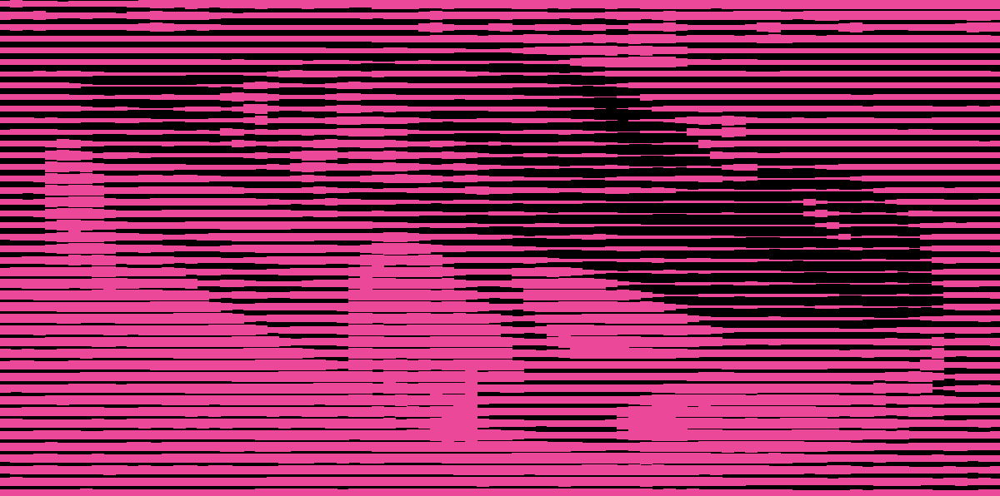

### cross-hatch

Multiple line-halftone passes at different angles, each gated by a brightness threshold. Darker areas get more layers of hatching. Pink lines on transparent background.

```bash
python3 ./cross-hatch/cross-hatch.py <input> [output] [--layers N] [--spacing N] [--thresholds N,N,N]
```

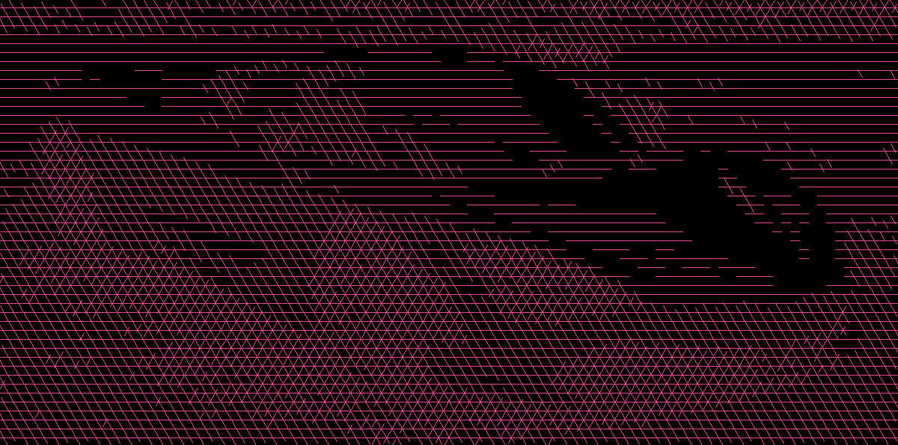

### stipple

Random dot placement where density maps to brightness. Pink dots on transparent background.

```bash
python3 ./stipple/stipple.py <input> [output] [--dots N] [--dot-size N] [--seed N]
```

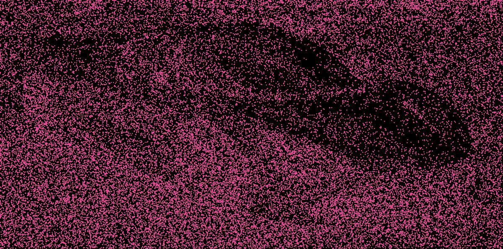


### isolate-threshold

Extract dark pixels from an image with a transparent background. Optionally recolor them and upscale with nearest-neighbor.

```bash
./isolate-threshold/isolate-threshold.sh <input> [output] [--scale N] [--threshold N] [--color "#hex"]
```

Default: `--scale 1 --threshold 50 --color "#ff0000"`


### channel-swap

Rearrange RGB channels — swap, duplicate, or reorder color channels.

```bash
python3 ./channel-swap/channel-swap.py <input> [output] [--map B,G,R]
```

Default: `--map B,G,R` (swaps red and blue)


### echo

Composite the image on itself with offset and fade for a ghosting/echo effect.

```bash
python3 ./echo/echo.py <input> [output] [--count N] [--offset-x N] [--offset-y N] [--decay N] [--blend additive|screen|multiply]
```

Default: `--count 12 --offset-x 30 --offset-y 12 --decay 0.6 --blend additive`


### invert-lightness

Invert the lightness channel in LAB color space — dark becomes light and vice versa, while hue and saturation are preserved.

```bash
python3 ./invert-lightness/invert-lightness.py <input> [output]
```


### kaleidoscope

Extract a wedge from the image and mirror/rotate it around the center for a kaleidoscope effect.

```bash
python3 ./kaleidoscope/kaleidoscope.py <input> [output] [--segments N] [--angle N]
```

Default: `--segments 6 --angle 90`


### polar

Remap image between Cartesian and polar coordinates.

```bash
python3 ./polar/polar.py <input> [output] [--mode to-polar|from-polar]
```

Default: `--mode to-polar`


### posterize-hsv

Quantize HSV channels independently for a posterized look with hue control.

```bash
python3 ./posterize-hsv/posterize-hsv.py <input> [output] [--h-levels N] [--s-levels N] [--v-levels N]
```

Default: `--h-levels 8 --s-levels 4 --v-levels 4`


### raw-bend

Treat pixel data as a raw audio signal and apply echo, chorus, and bitcrush distortion.

```bash
python3 ./raw-bend/raw-bend.py <input> [output] [--echo-strength N] [--echo-delay N] [--chorus N] [--bitcrush N]
```

Default: `--echo-strength 0.5 --echo-delay 500 --chorus 0.3 --bitcrush 0`


### seam-carve

Content-aware image resizing by removing low-energy vertical seams.

```bash
python3 ./seam-carve/seam-carve.py <input> [output] [--percent N] [--energy gradient|sobel]
```

Default: `--percent 35 --energy sobel`


### slit-scan

Take one column from each rotation of the image and stitch them together for a slit-scan effect.

```bash
python3 ./slit-scan/slit-scan.py <input> [output] [--slits N] [--max-angle N]
```

Default: `--slits <width> --max-angle 180`


### thermal

Map brightness to a false-color thermal palette (black to blue to red to yellow to white).

```bash
python3 ./thermal/thermal.py <input> [output]
```


### tile-shuffle

Chop the image into an NxN grid and randomly permute the tiles.

```bash
python3 ./tile-shuffle/tile-shuffle.py <input> [output] [--grid N] [--seed N]
```

Default: `--grid 4`

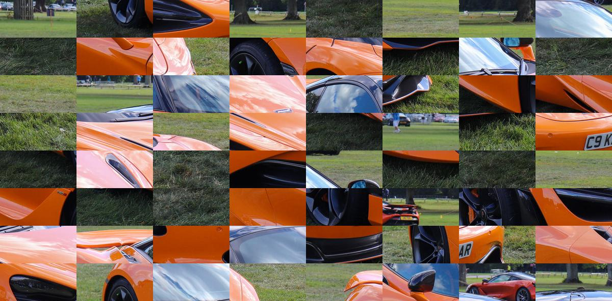

### wrong-stride

Flatten the pixel buffer and reshape with a wrong row width for a diagonal shear glitch.

```bash
python3 ./wrong-stride/wrong-stride.py <input> [output] [--offset N]
```

Default: `--offset 1`


### fft-phase

Keep each channel's Fourier magnitude and blend in random phase, so the image dissolves into a texture with the same spectrum.

```bash
python3 ./fft-phase/fft-phase.py <input> [output] [--amount N] [--seed N]
```

Default: `--amount 0.35`

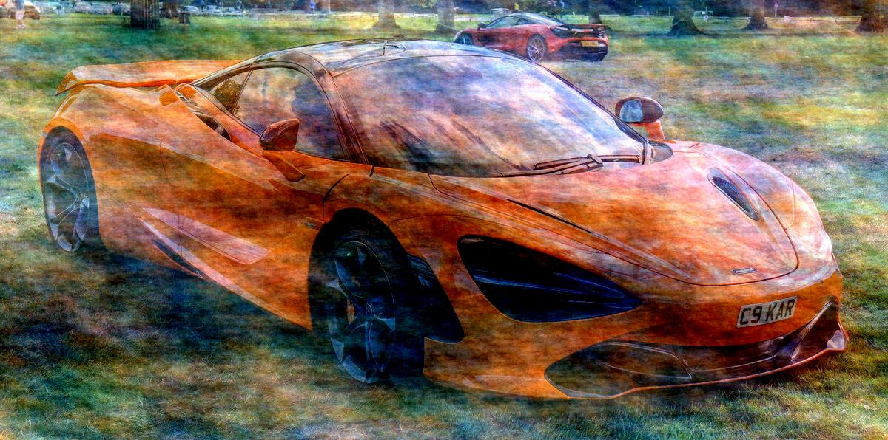

### zoom-blur

Average copies of the image scaled up about a centre point, for radial warp-speed streaks.

```bash
python3 ./zoom-blur/zoom-blur.py <input> [output] [--amount N] [--center X,Y] [--samples N]
```

Default: `--amount 0.3 --center 0.5,0.5 --samples 32`


### swirl

Twist the image around a centre, with the rotation fading out toward a radius.

```bash
python3 ./swirl/swirl.py <input> [output] [--angle DEG] [--radius N] [--center X,Y]
```

Default: `--angle 360 --radius 1.0 --center 0.5,0.5`

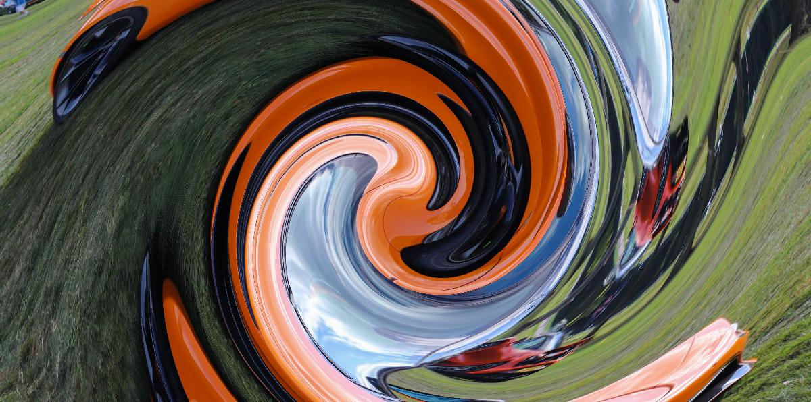

### displace

Move each pixel along an angle by an amount taken from its own blurred brightness, so light and dark areas tear apart in opposite directions.

```bash
python3 ./displace/displace.py <input> [output] [--amount PX] [--angle DEG] [--blur N]
```

Default: `--amount 60 --angle 0 --blur 3`

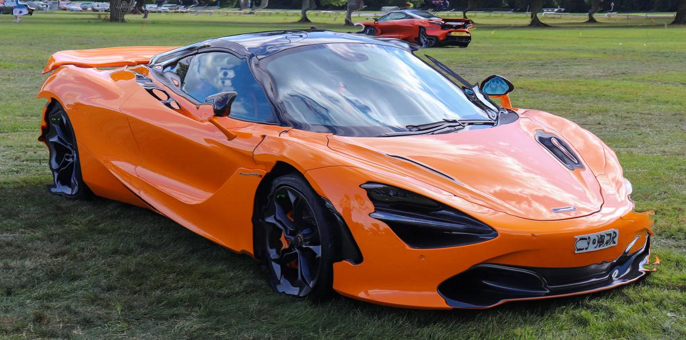

### drip

Bleed bright pixels in one direction with a fading tail, like wet paint running.

```bash
python3 ./drip/drip.py <input> [output] [--length PX] [--threshold N] [--direction down|up|left|right]
```

Default: `--length 120 --threshold 180 --direction down`

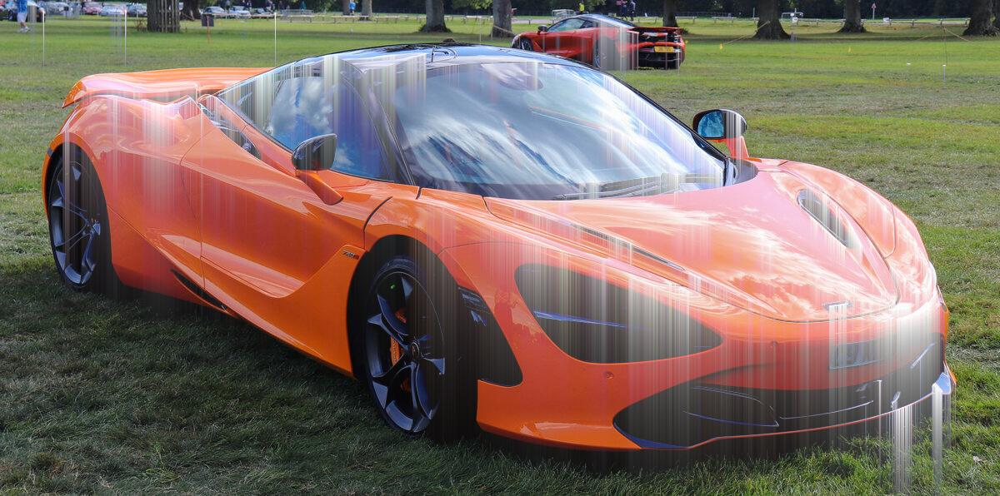

### edge-glow

Turn edges into neon lines in each pixel's own hue, with a soft halo, over a darkened base.

```bash
python3 ./edge-glow/edge-glow.py <input> [output] [--amount N] [--radius N]
```

Default: `--amount 1 --radius 6`

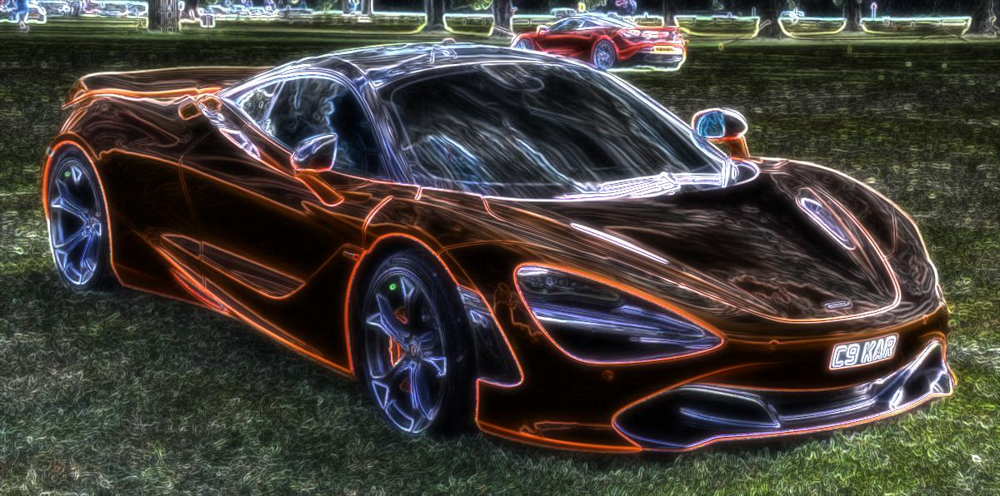

### contour

Draw lines where brightness crosses N levels, like a topographic map of the photo. Pink lines on black by default.

```bash
python3 ./contour/contour.py <input> [output] [--levels N] [--blur N] [--width PX] [--color HEX] [--amount N]
```

Default: `--levels 16 --blur 2 --width 1 --color #ec4899 --amount 1`


### hue-isolate

Keep one hue band in full colour and turn everything else grey.

```bash
python3 ./hue-isolate/hue-isolate.py <input> [output] [--hue DEG] [--width DEG] [--amount N]
```

Default: `--hue 25 --width 20 --amount 1` (orange)

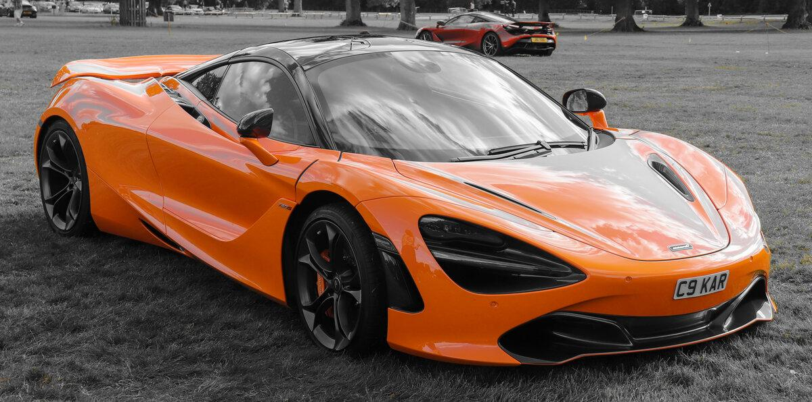

### bloom

Pull out the highlights, blur them at three radii and screen them back for a soft glow.

```bash
python3 ./bloom/bloom.py <input> [output] [--amount N] [--threshold N] [--radius N]
```

Default: `--amount 1 --threshold 170 --radius 8`

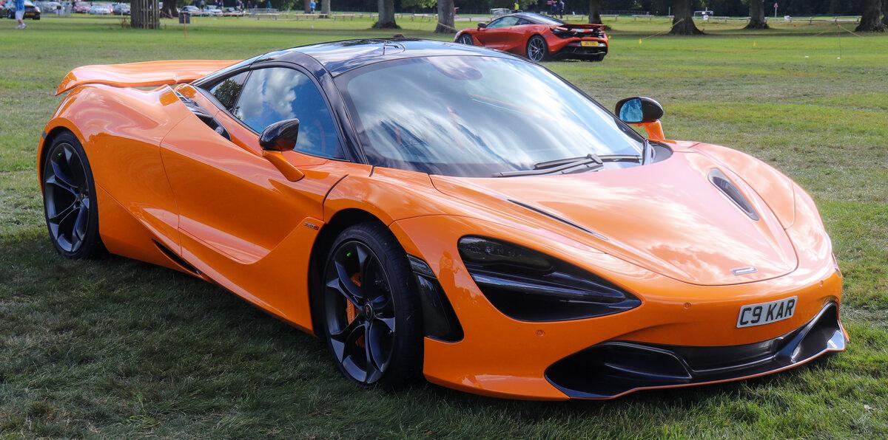

### voronoi-mosaic

Split the image into irregular Voronoi cells filled with their average colour, with optional dark leading like stained glass.

```bash
python3 ./voronoi-mosaic/voronoi-mosaic.py <input> [output] [--size PX] [--jitter N] [--edges PX] [--seed N]
```

Default: `--size 24 --jitter 1 --edges 0`


### oil-paint

Kuwahara filter: smooth into flat painterly patches while keeping edges crisp.

```bash
python3 ./oil-paint/oil-paint.py <input> [output] [--radius N]
```

Default: `--radius 6`


### tilt-shift

Blur away from a horizontal focus band and lift the colour, so the scene looks like a miniature.

```bash
python3 ./tilt-shift/tilt-shift.py <input> [output] [--blur N] [--focus N] [--band N]
```

Default: `--blur 10 --focus 0.62 --band 0.25`


### flow-streak

Smear the image along its own contours for brushed, combed strokes.

```bash
python3 ./flow-streak/flow-streak.py <input> [output] [--length N] [--sigma N]
```

Default: `--length 36 --sigma 6`


### crt

Show the image on a simulated CRT: curved glass, an RGB stripe mask, scanlines and a slight glow.

```bash
python3 ./crt/crt.py <input> [output] [--amount N] [--pitch PX] [--curve N]
```

Default: `--amount 1 --pitch 3 --curve 0.12`

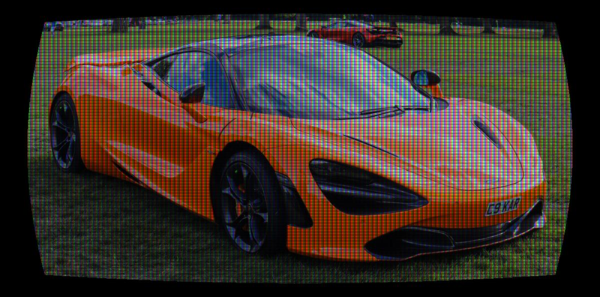

### dither

Dither to N levels per channel with a Bayer matrix, or with Floyd–Steinberg or Atkinson error diffusion. Error diffusion takes a few seconds on the README image.

```bash
python3 ./dither/dither.py <input> [output] [--method bayer|floyd|atkinson] [--levels N] [--matrix 2|4|8]
```

Default: `--method bayer --levels 2 --matrix 8`


### jpeg-rot

Re-save as a low-quality JPEG many times, shifting a pixel each time so the damage piles up instead of settling.

```bash
python3 ./jpeg-rot/jpeg-rot.py <input> [output] [--quality N] [--generations N]
```

Default: `--quality 10 --generations 30`

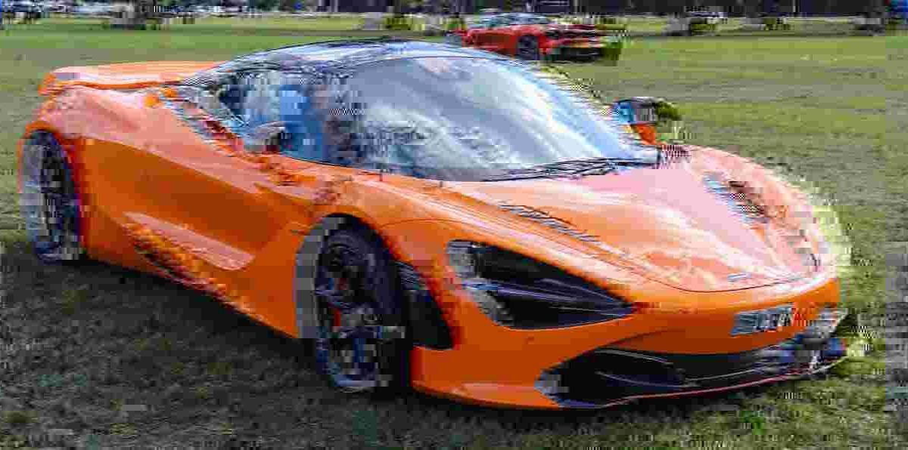

### ascii

Replace each cell with a bold character chosen by brightness, stretched to the image's own range, drawn in the cell's hue on black.

```bash
python3 ./ascii/ascii.py <input> [output] [--cell PX] [--charset CHARS]
```

Default: `--cell 10 --charset " .:-=+*#%@"`

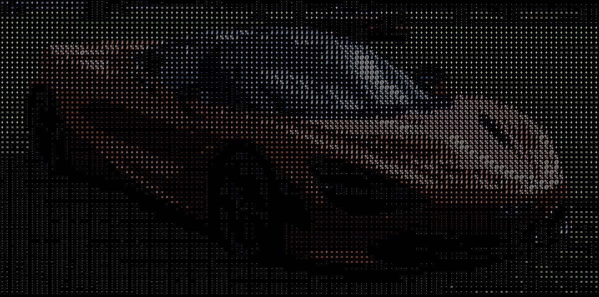
