# op-img


op-img is a composable image manipulation CLI:

```bash
op-img <patch> <input> [--args]
```

## Install

Install op-img with [pipx](https://pipx.pypa.io/):

```bash
pipx install op-img
```

Or, on macOS or Linux, with [Homebrew](https://brew.sh/):

```bash
brew install service-dept/tap/op-img
```

Either one puts the `op-img` command on your PATH, along with Pillow, numpy and scipy.

### From source

To work on op-img itself, run it from a clone instead. Clone the repository:

```bash
git clone https://github.com/service-dept/op-img.git
```

Move into it:

```bash
cd op-img
```

Install Pillow, numpy and scipy for Python 3.10 or later:

```bash
pip3 install Pillow numpy scipy
```

Link `op-img` onto your PATH, so your edits take effect wherever you run it. This may need `sudo`:

```bash
ln -s "$(pwd)/op-img" /usr/local/bin/op-img
```

## Quick start

Every command names a patch, then the input image, then an optional output, then the patch's options:

```bash
op-img <patch> <input> [output] [--args]
```

Without an output, op-img saves the result next to the input, with the patch's suffix added to the name.

Show the usage and three patches at random:

```bash
op-img
```

List every patch:

```bash
op-img --list
```

Show a patch's options:

```bash
op-img --info pixel-sort
```

Crush the colors to 1 bit per channel:

```bash
op-img bit-crush photo.jpg
```

Sort the pixels, saving `photo-psort.jpg` next to `photo.jpg` because no output is given:

```bash
op-img pixel-sort photo.jpg
```

Draw halftone dots 8 px apart and save them as `out.png`:

```bash
op-img dot-halftone photo.jpg out.png --spacing 8
```

Snap every pixel to black, white or red:

```bash
op-img closest-palette photo.jpg --palette "#000,#fff,#f00"
```

To run several patches in a row, see Stacking patches below.

## Patches

All examples below use this image as input:


### bit-crush

Reduce color depth to N bits per channel, with a light dither that leaves flat, saturated blotches.

```bash
op-img bit-crush <input> [output] [--bits N]
```

Default: `--bits 1` (2 levels per channel, 8 colors)

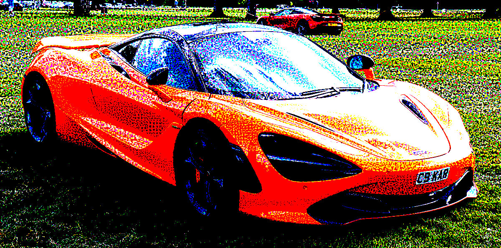

### res-crush

Downscale to a tiny resolution and upscale back with nearest-neighbor for a chunky pixel look.

```bash
op-img res-crush <input> [output] [--size N]
```

Default: `--size 64`


### channel-offset

Shift R, G, B channels by independent pixel amounts for a misregistered print / chromatic aberration look.

```bash
op-img channel-offset <input> [output] [--r X,Y] [--g X,Y] [--b X,Y]
```

Default: `--r 140,50 --g -20,40 --b -120,-40`

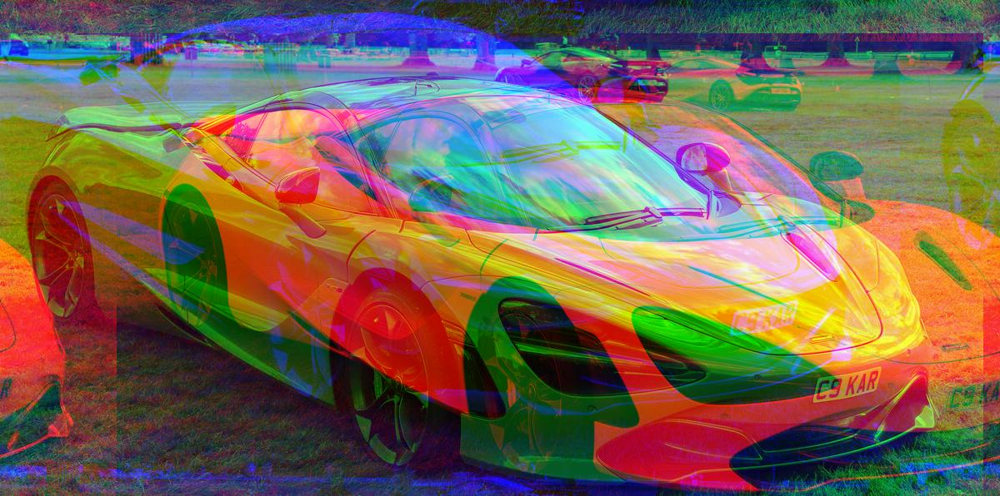

### fold

Mirror or repeat one half of the image across a fold line.

```bash
op-img fold <input> [output] [--axis x|y] [--position N] [--mode mirror|repeat]
```

Default: `--axis x --position center --mode mirror`

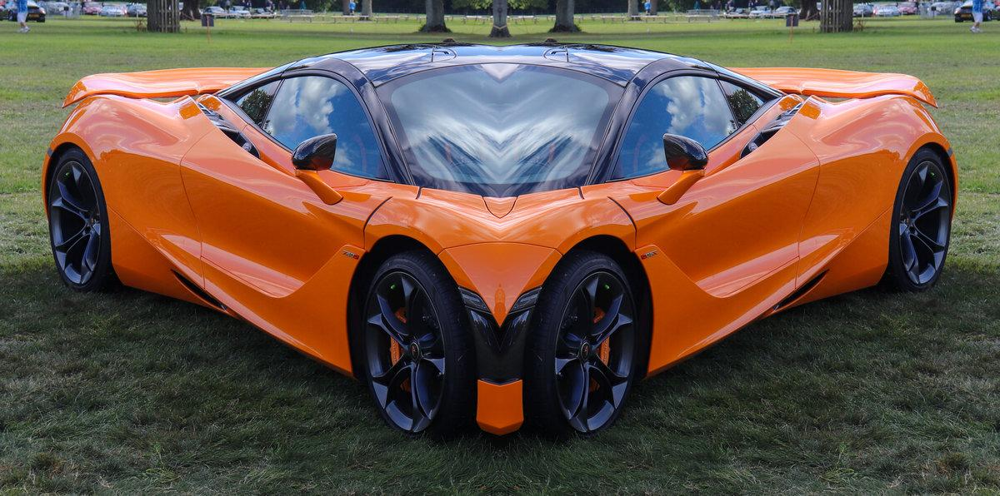

### pixel-sort

Sort contiguous runs of pixels by brightness, hue, or saturation.

```bash
op-img pixel-sort <input> [output] [--by brightness|hue|saturation] [--threshold N] [--direction row|column]
```

Default: `--threshold 200`

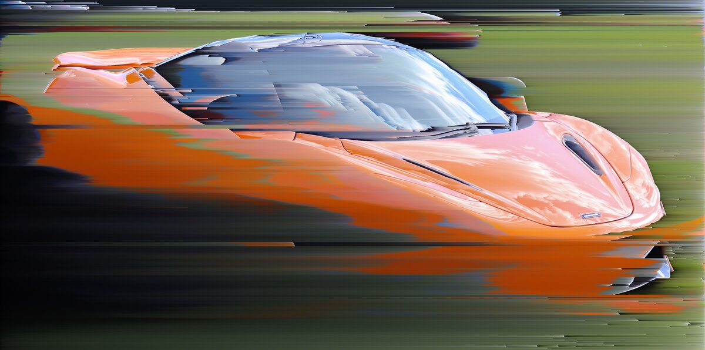

### scan-glitch

Randomly shift horizontal slices of the image for a broken-signal effect.

```bash
op-img scan-glitch <input> [output] [--severity N] [--seed N]
```

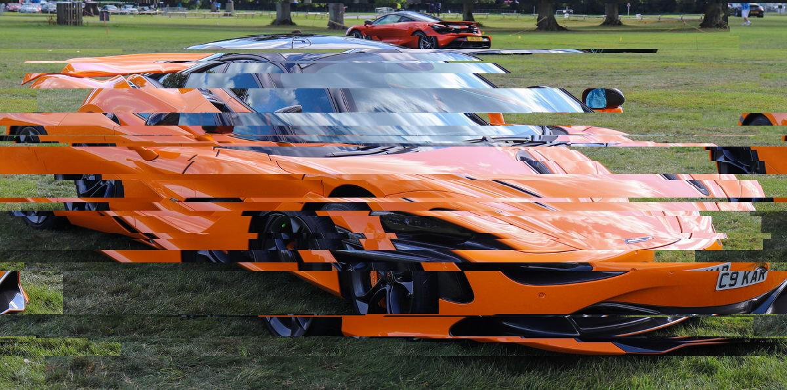

### echo

Composite the image on itself with offset and fade for a ghosting/echo effect.

```bash
op-img echo <input> [output] [--count N] [--offset-x N] [--offset-y N] [--decay N] [--blend additive|screen|multiply]
```

Default: `--count 12 --offset-x 30 --offset-y 12 --decay 0.6 --blend additive`

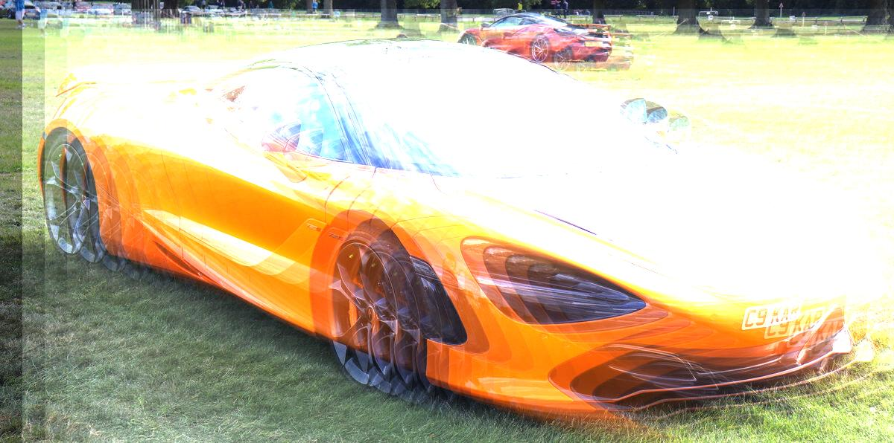

### kaleidoscope

Extract a wedge from the image and mirror/rotate it around the center for a kaleidoscope effect.

```bash
op-img kaleidoscope <input> [output] [--segments N] [--angle N]
```

Default: `--segments 6 --angle 90`

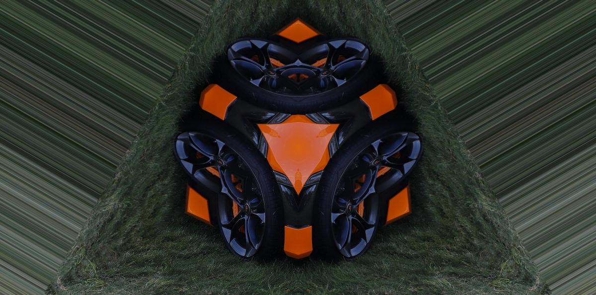

### polar

Remap image between Cartesian and polar coordinates. `--center` moves the pole, `--rotate` turns where the seam falls, and `--radius` sets how far out the rings reach. Use the same values for `to-polar` and `from-polar` to map back.

```bash
op-img polar <input> [output] [--mode to-polar|from-polar] [--center X,Y] [--rotate DEG] [--radius N]
```

Default: `--mode to-polar --center 0.5,0.5 --rotate 0 --radius 1`

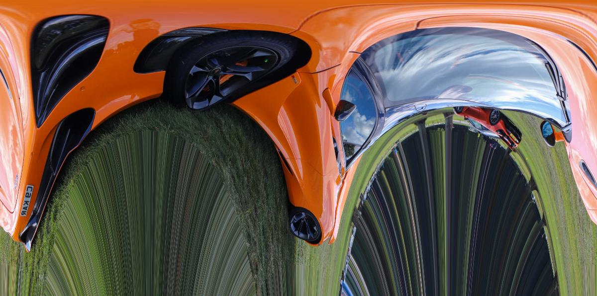

### raw-bend

Treat pixel data as a raw audio signal and apply echo, chorus, and bitcrush distortion.

```bash
op-img raw-bend <input> [output] [--echo-strength N] [--echo-delay N] [--chorus N] [--bitcrush N]
```

Default: `--echo-strength 0.8 --echo-delay 2000 --chorus 0.7 --bitcrush 0`

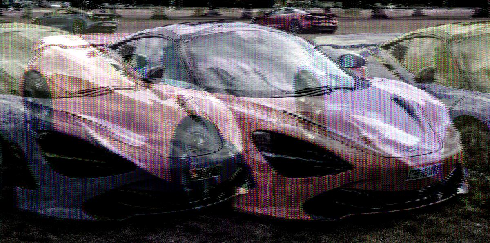

### seam-carve

Content-aware image resizing by removing low-energy vertical seams.

```bash
op-img seam-carve <input> [output] [--percent N] [--energy gradient|sobel]
```

Default: `--percent 35 --energy sobel`

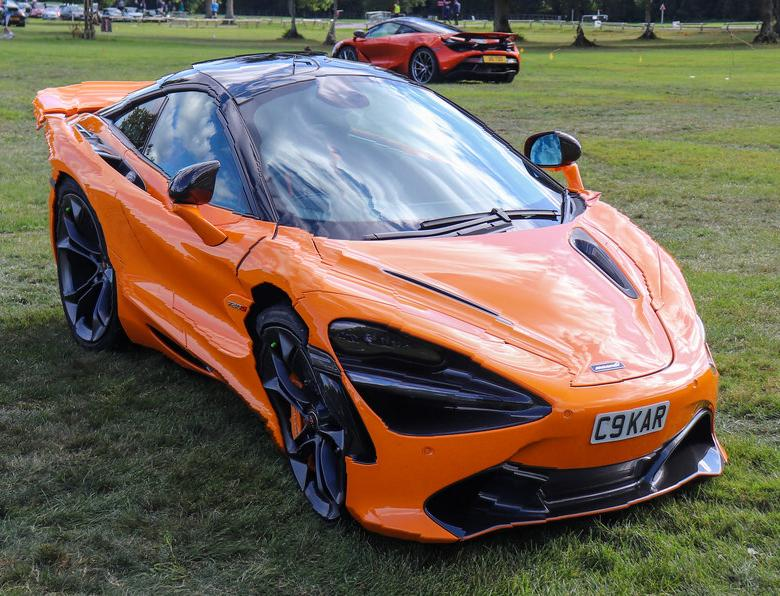

### slit-scan

Take one column from each rotation of the image and stitch them together for a slit-scan effect.

```bash
op-img slit-scan <input> [output] [--slits N] [--max-angle N]
```

Default: `--slits <width> --max-angle 180`

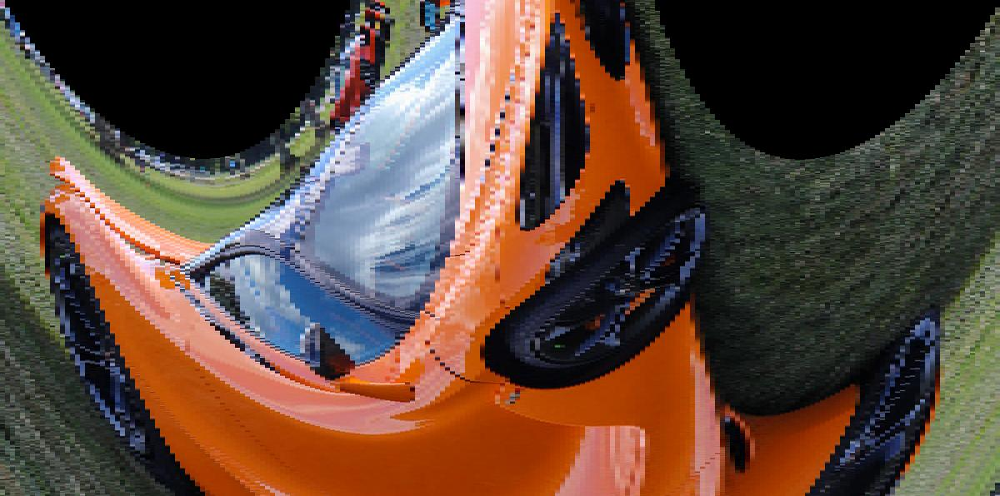

### tile-shuffle

Chop the image into an NxN grid and randomly permute the tiles.

```bash
op-img tile-shuffle <input> [output] [--grid N] [--seed N]
```

Default: `--grid 8`


### wrong-stride

Flatten the pixel buffer and reshape with a wrong row width for a diagonal shear glitch.

```bash
op-img wrong-stride <input> [output] [--offset N]
```

Default: `--offset 1`

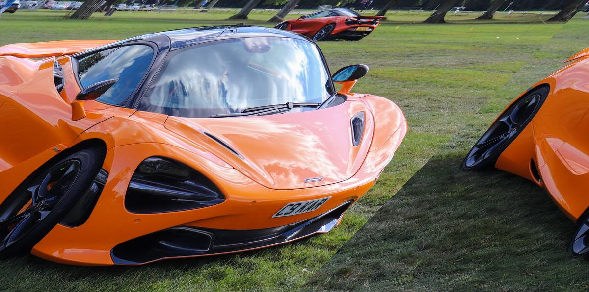

### fft-phase

Keep each channel's Fourier magnitude and blend in random phase, so the image dissolves into a texture with the same spectrum.

```bash
op-img fft-phase <input> [output] [--amount N] [--seed N]
```

Default: `--amount 0.35`


### zoom-blur

Average copies of the image scaled up about a center point, for radial warp-speed streaks.

```bash
op-img zoom-blur <input> [output] [--amount N] [--center X,Y] [--samples N]
```

Default: `--amount 0.3 --center 0.5,0.5 --samples 32`

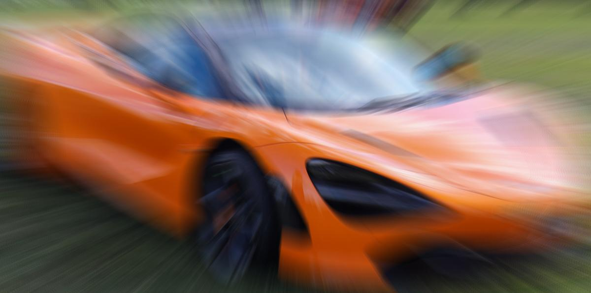

### swirl

Twist the image around a center, with the rotation fading out toward a radius.

```bash
op-img swirl <input> [output] [--angle DEG] [--radius N] [--center X,Y]
```

Default: `--angle 360 --radius 1.0 --center 0.5,0.5`


### displace

Move each pixel along an angle by an amount taken from its own blurred brightness, so light and dark areas tear apart in opposite directions.

```bash
op-img displace <input> [output] [--amount PX] [--angle DEG] [--blur N]
```

Default: `--amount 150 --angle 0 --blur 3`

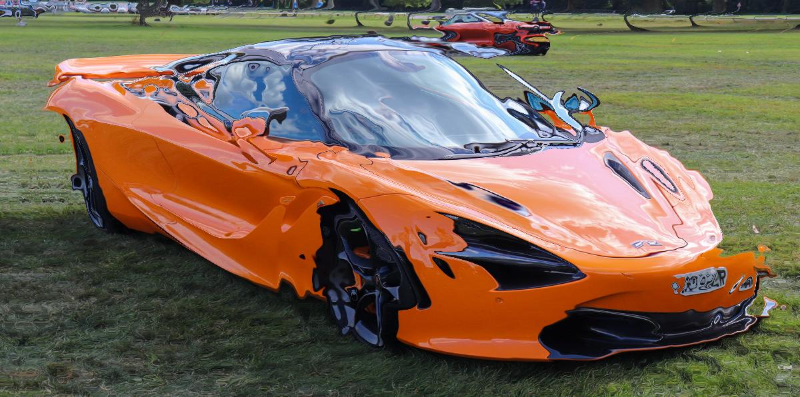

### drip

Bleed bright pixels in one direction with a fading tail, like wet paint running.

```bash
op-img drip <input> [output] [--length PX] [--threshold N] [--direction down|up|left|right]
```

Default: `--length 500 --threshold 120 --direction down`

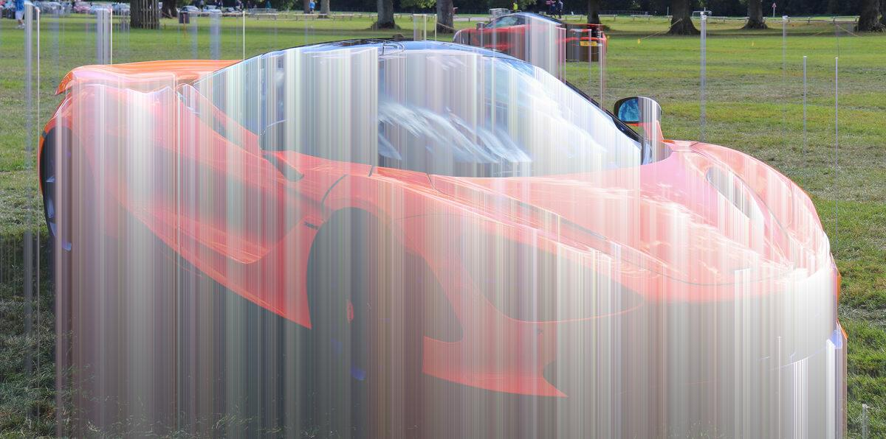

### edge-glow

Turn edges into neon lines in each pixel's own hue, with a soft halo, over a darkened base.

```bash
op-img edge-glow <input> [output] [--amount N] [--radius N]
```

Default: `--amount 1 --radius 6`


### contour

Draw lines where brightness crosses N levels, like a topographic map of the photo. Pink lines on black by default.

```bash
op-img contour <input> [output] [--levels N] [--blur N] [--width PX] [--color HEX] [--amount N]
```

Default: `--levels 16 --blur 2 --width 1 --color #ec4899 --amount 1`

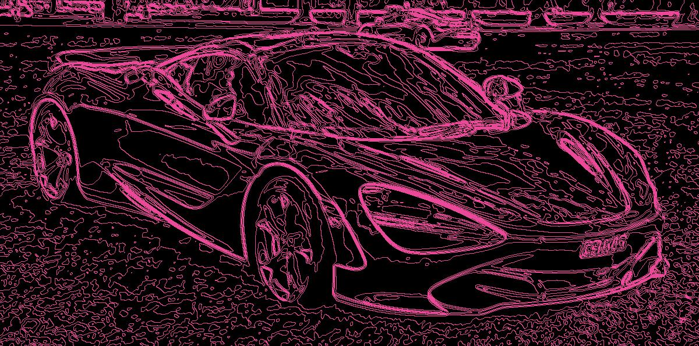

### bloom

Pull out the highlights, blur them at three radii and screen them back for a soft glow.

```bash
op-img bloom <input> [output] [--amount N] [--threshold N] [--radius N]
```

Default: `--amount 2 --threshold 110 --radius 16`

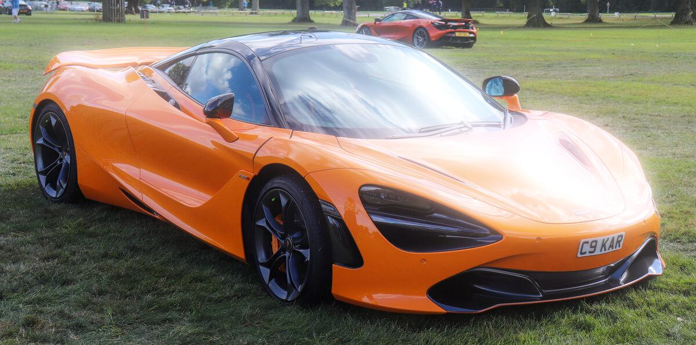

### voronoi-mosaic

Split the image into irregular Voronoi cells filled with their average color, with optional dark leading like stained glass.

```bash
op-img voronoi-mosaic <input> [output] [--size PX] [--jitter N] [--edges PX] [--seed N]
```

Default: `--size 24 --jitter 1 --edges 0`


### oil-paint

Kuwahara filter: smooth into flat painterly patches while keeping edges crisp.

```bash
op-img oil-paint <input> [output] [--radius N]
```

Default: `--radius 6`

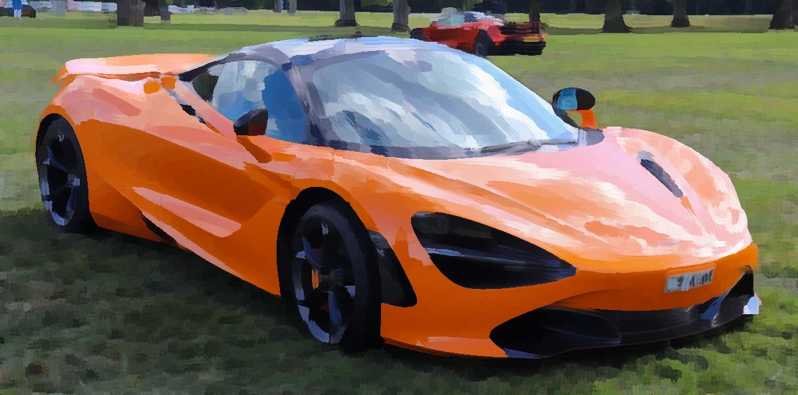

### tilt-shift

Blur away from a horizontal focus band and lift the color, so the scene looks like a miniature.

```bash
op-img tilt-shift <input> [output] [--blur N] [--focus N] [--band N]
```

Default: `--blur 10 --focus 0.62 --band 0.25`


### flow-streak

Smear the image along its own contours for brushed, combed strokes.

```bash
op-img flow-streak <input> [output] [--length N] [--sigma N]
```

Default: `--length 36 --sigma 6`


### dither

Dither to N levels per channel with a Bayer matrix, or with Floyd–Steinberg or Atkinson error diffusion. Error diffusion takes a few seconds on the README image.

```bash
op-img dither <input> [output] [--method bayer|floyd|atkinson] [--levels N] [--matrix 2|4|8]
```

Default: `--method bayer --levels 2 --matrix 8`

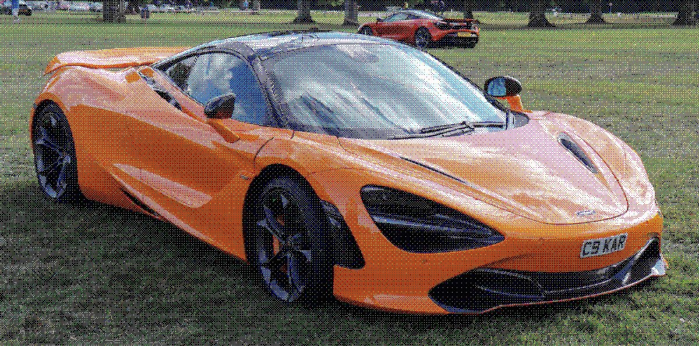

### jpeg-rot

Re-save as a low-quality JPEG many times, shifting a pixel each time so the damage piles up instead of settling.

```bash
op-img jpeg-rot <input> [output] [--quality N] [--generations N]
```

Default: `--quality 5 --generations 80`

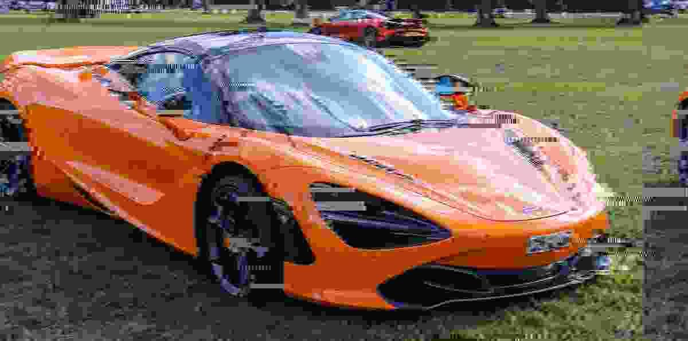

### ascii

Replace each cell with a bold character chosen by brightness, stretched to the image's own range, drawn in the cell's hue on black.

```bash
op-img ascii <input> [output] [--cell PX] [--charset CHARS]
```

Default: `--cell 10 --charset " .:-=+*#%@"`

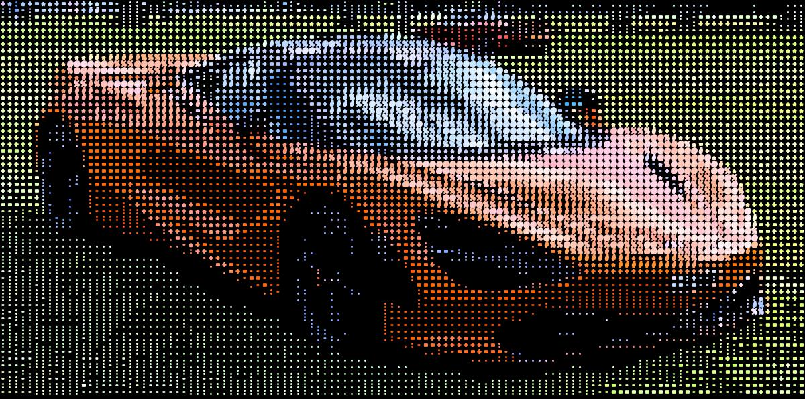

### isolate-threshold

Keep the pixels brighter than a threshold as a flat color on a transparent background, optionally upscaled with nearest-neighbor. The default output is PNG; a JPEG output gets a white background.

```bash
op-img isolate-threshold <input> [output] [--threshold N] [--color "#hex"] [--scale N]
```

Default: `--threshold 50 --color "#ff0000" --scale 1`

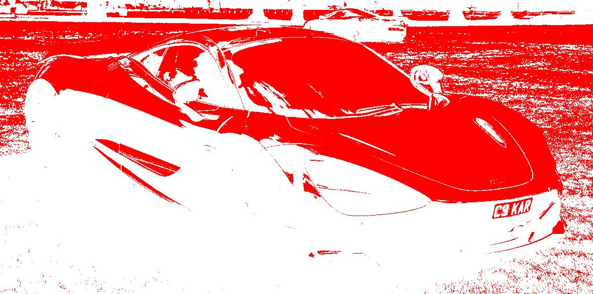

### closest-palette

Snap every pixel to its nearest color in a given palette. No dithering -- hard color boundaries.

```bash
op-img closest-palette <input> [output] --palette "#hex,#hex,..."
op-img closest-palette <input> [output] --from-image ref.png --colors N
```

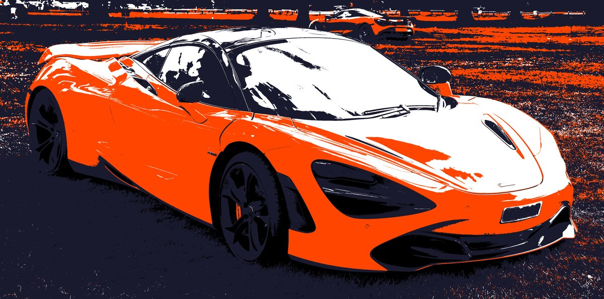

### invert-lightness

Invert the lightness channel in LAB color space — dark becomes light and vice versa, while hue and saturation are preserved.

```bash
op-img invert-lightness <input> [output]
```

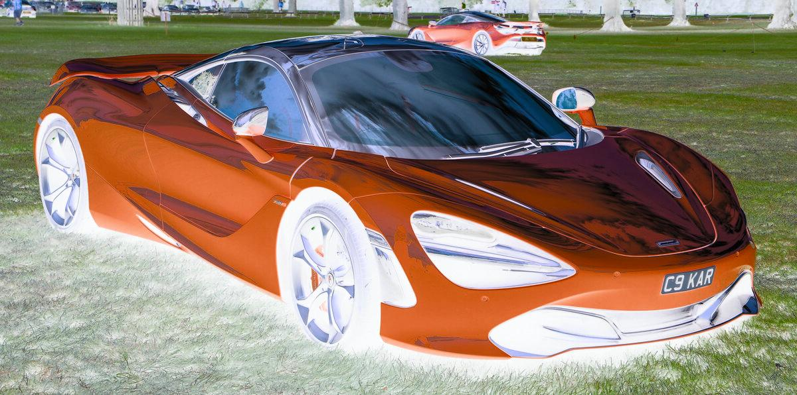

### posterize-hsv

Quantize HSV channels independently for a posterized look with hue control.

```bash
op-img posterize-hsv <input> [output] [--h-levels N] [--s-levels N] [--v-levels N]
```

Default: `--h-levels 8 --s-levels 4 --v-levels 4`

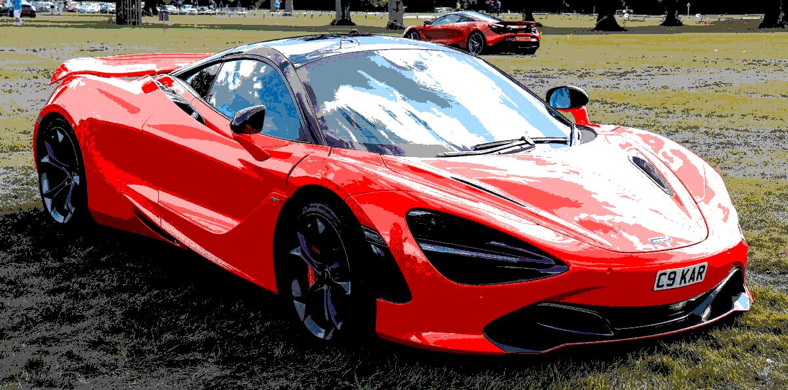

### thermal

Map brightness to a false-color thermal palette (black to blue to red to yellow to white).

```bash
op-img thermal <input> [output]
```

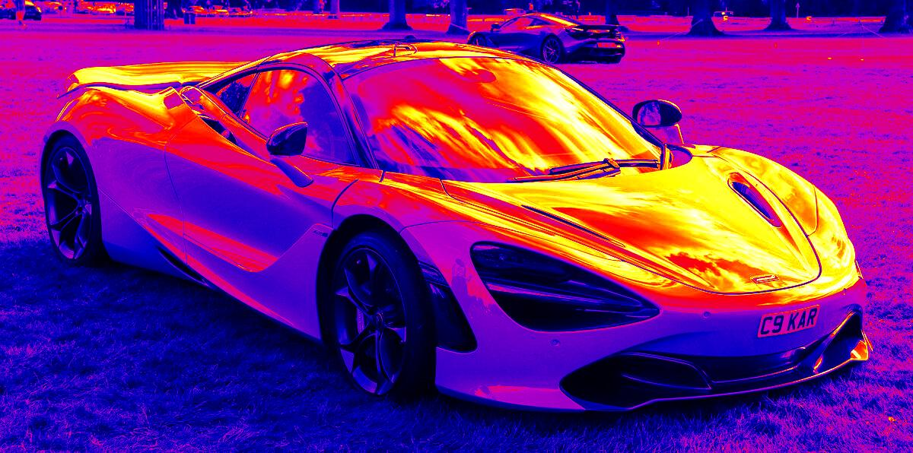

### hue-isolate

Keep one hue band in full color and turn everything else gray.

```bash
op-img hue-isolate <input> [output] [--hue DEG] [--width DEG] [--amount N]
```

Default: `--hue 25 --width 20 --amount 1` (orange)


### channel-swap

Rearrange RGB channels — swap, duplicate, or reorder color channels.

```bash
op-img channel-swap <input> [output] [--map B,G,R]
```

Default: `--map B,G,R` (swaps red and blue)

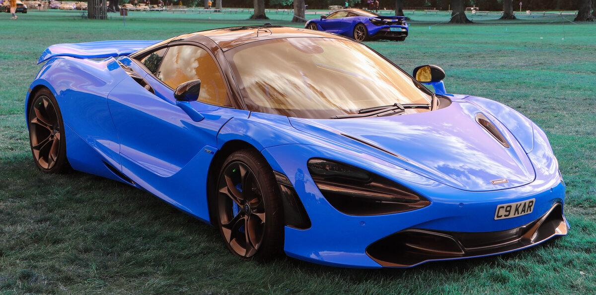

### recolor

Repaint the image's most prevalent colors with the colors you give, most prevalent first, keeping their light and shade. Grays, black and white are left alone.

```bash
op-img recolor <input> [output] [--colors C1,C2] [--amount N] [--clusters N]
```

Default: `--colors "#1e3a8a,#facc15" --amount 1 --clusters 6`

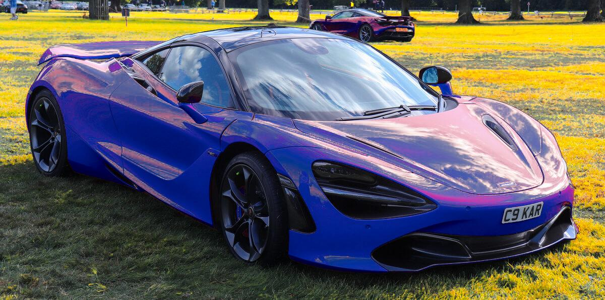

### dot-halftone

Convert to a halftone dot grid where dot size varies with brightness. Pink dots on transparent background.

```bash
op-img dot-halftone <input> [output] [--spacing N] [--min-dot N] [--max-dot N] [--angle N]
```

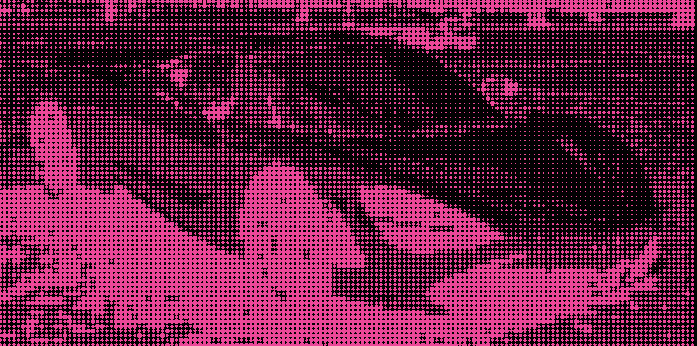

### line-halftone

Variable-width lines whose thickness maps to brightness. Pink lines on transparent background.

```bash
op-img line-halftone <input> [output] [--spacing N] [--min-width N] [--max-width N] [--angle N]
```


### cross-hatch

Multiple line-halftone passes at different angles, each gated by a brightness threshold. Darker areas get more layers of hatching. Pink lines on transparent background.

```bash
op-img cross-hatch <input> [output] [--layers N] [--spacing N] [--thresholds N,N,N]
```


### stipple

Random dot placement where density maps to brightness. Pink dots on transparent background.

```bash
op-img stipple <input> [output] [--dots N] [--dot-size N] [--seed N]
```


## Stacking patches

Join patches with `+` to run them one after another, each one building on the previous result:

```bash
op-img <patch> <input> [output] [--args] + <patch> [--args] + ...
```

```bash
op-img pixel-sort photo.jpg + fold + polar            # writes photo-psort-fold-polar.jpg
op-img pixel-sort photo.jpg --by hue + channel-swap   # options follow the patch they belong to
op-img seam-carve photo.jpg out.jpg + thermal         # an output after the input names the final file
```

The input, and the output if you give one, come right after the first patch. Subsequent patches only take arguments. Omit the output path to save the result in the same directory as the input, with each patch's suffix applied in order.

### contour + swirl

Contour traces the photo's brightness bands in pink lines, and swirl twists them into a vortex.

```bash
op-img contour photo.jpg + swirl
```

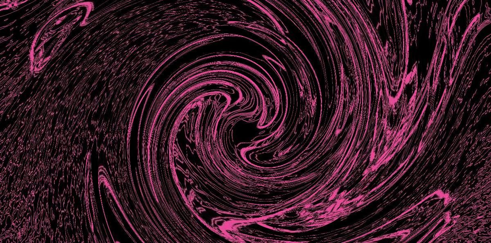

### fold + polar + pixel-sort + channel-swap

Fold mirrors the car, polar wraps it into an arch, pixel-sort streaks it, and channel-swap turns the orange blue.

```bash
op-img fold photo.jpg + polar --center 0.3,0.5 --rotate 200 --radius 0.9 + pixel-sort + channel-swap
```

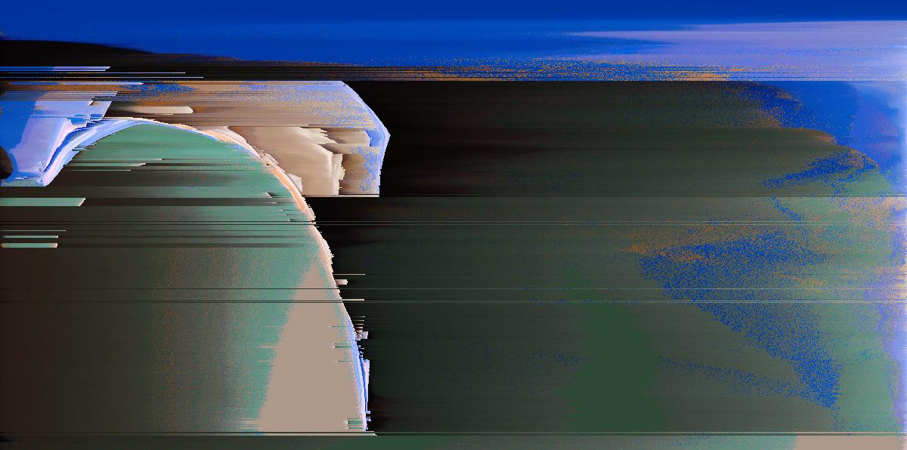

### thermal + invert-lightness

Heat colors first, then the lightness flipped, which turns the car magenta and pink.

```bash
op-img thermal photo.jpg + invert-lightness
```

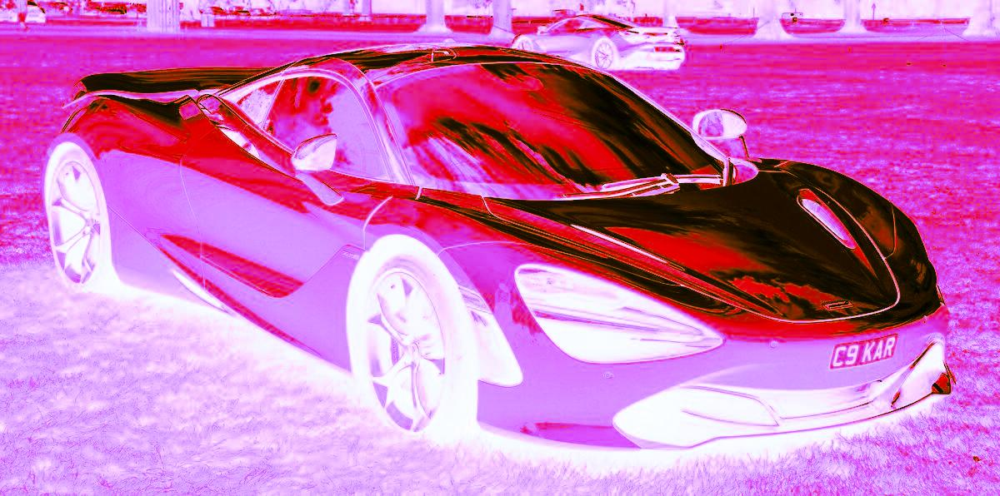

### invert-lightness + thermal

The same two patches the other way round: with the lightness flipped first, the paint reads cold and the tires and grass run white-hot.

```bash
op-img invert-lightness photo.jpg + thermal
```

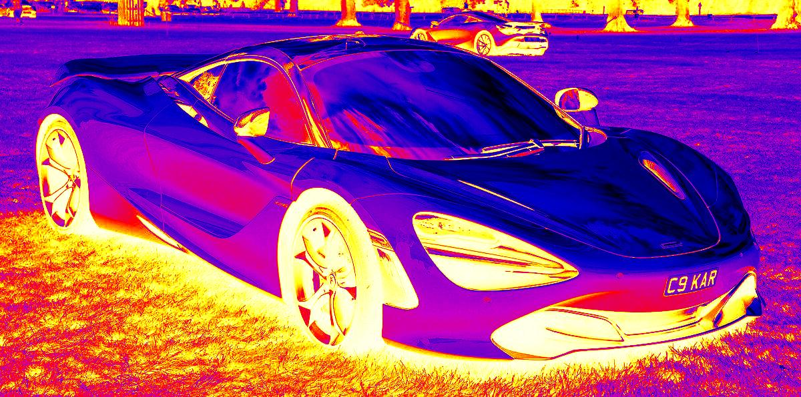

### slit-scan + thermal

Slit-scan melts the car into curves, and thermal paints them in heat colors.

```bash
op-img slit-scan photo.jpg + thermal
```

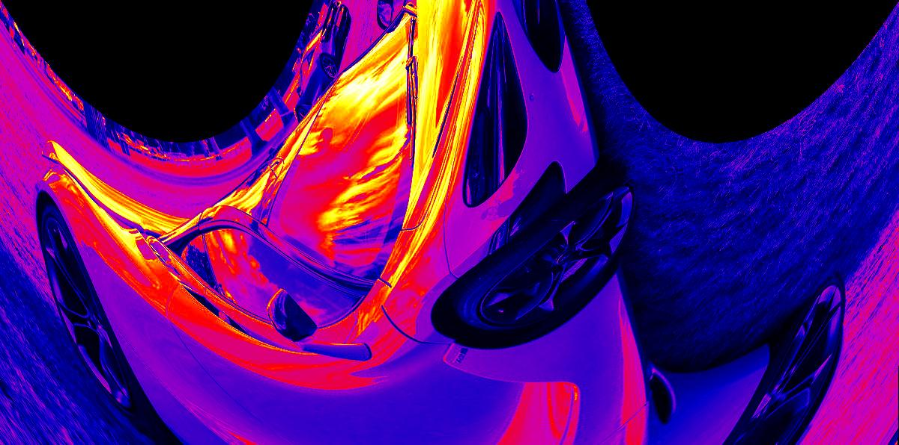

### polar + drip + polar

Drips run straight down in polar space, so they come back as rays bursting from an off-center pole.

```bash
op-img polar photo.jpg --center 0.62,0.4 --rotate 150 --radius 0.85 + drip --length 500 --threshold 120 + polar --mode from-polar --center 0.62,0.4 --rotate 150 --radius 0.85
```

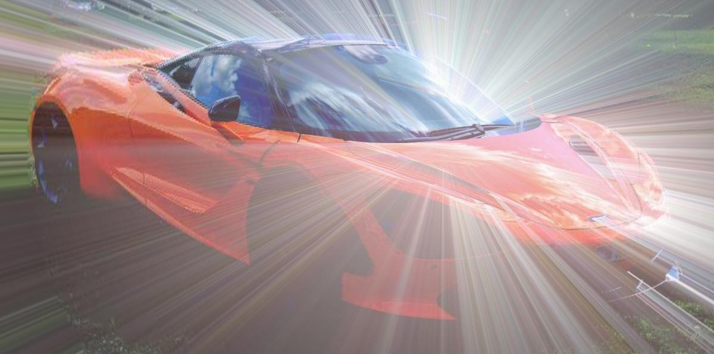

### polar + tile-shuffle + polar

Tiles shuffled in polar space come back as rings of turned wedges.

```bash
op-img polar photo.jpg + tile-shuffle --grid 8 + polar --mode from-polar
```

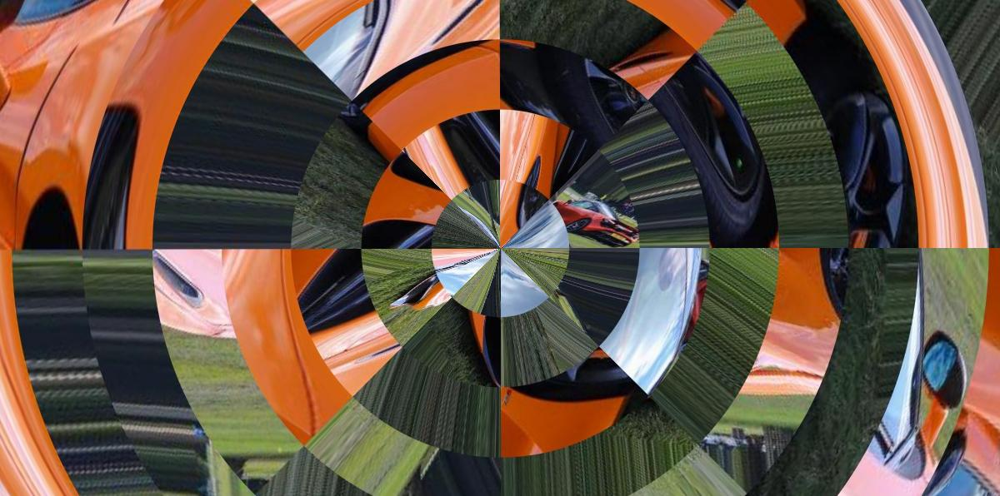

### dither + zoom-blur

Atkinson dithering, then a zoom blur that smears the dots into speed streaks.

```bash
op-img dither photo.jpg --method atkinson + zoom-blur
```

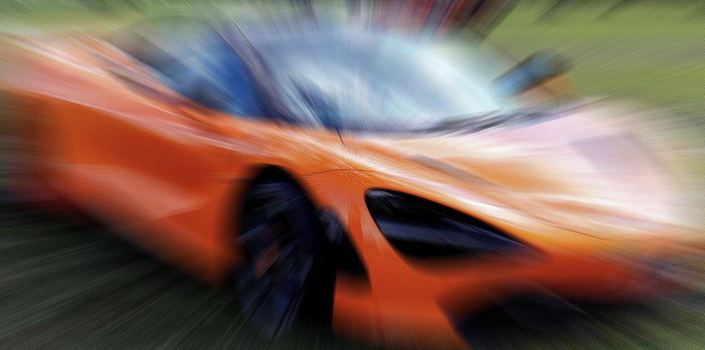

### kaleidoscope + ascii

A kaleidoscope emblem, redrawn in characters.

```bash
op-img kaleidoscope photo.jpg + ascii
```

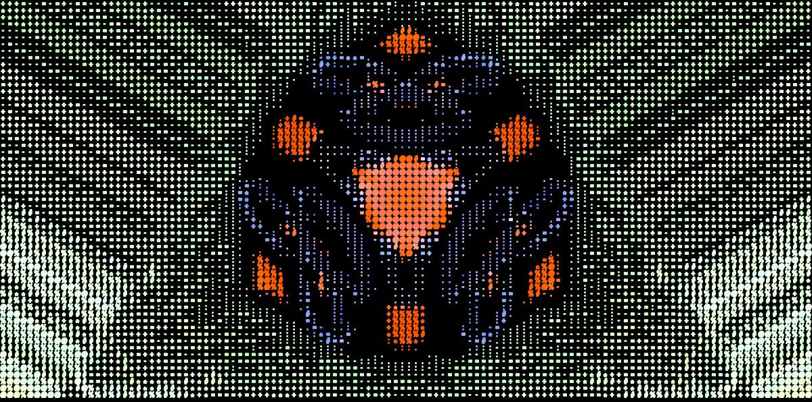

### scan-glitch + polar

Scan-glitch's torn rows, wrapped into arches around a shifted pole.

```bash
op-img scan-glitch photo.jpg + polar --center 0.72,0.3 --rotate 105 --radius 0.7
```

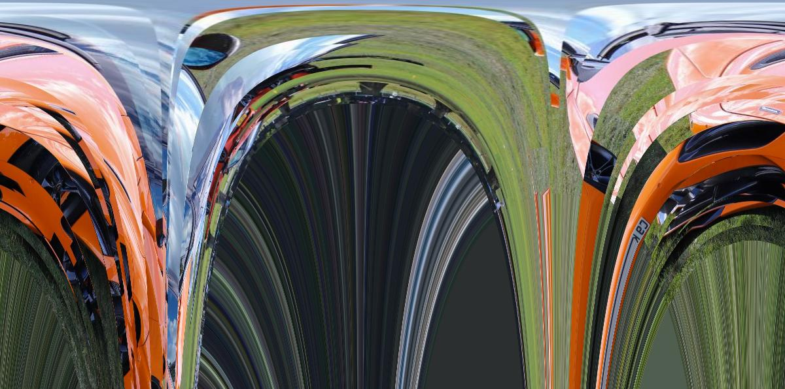

### swirl + kaleidoscope

A swirl, mirrored into a chrome mandala.

```bash
op-img swirl photo.jpg + kaleidoscope
```

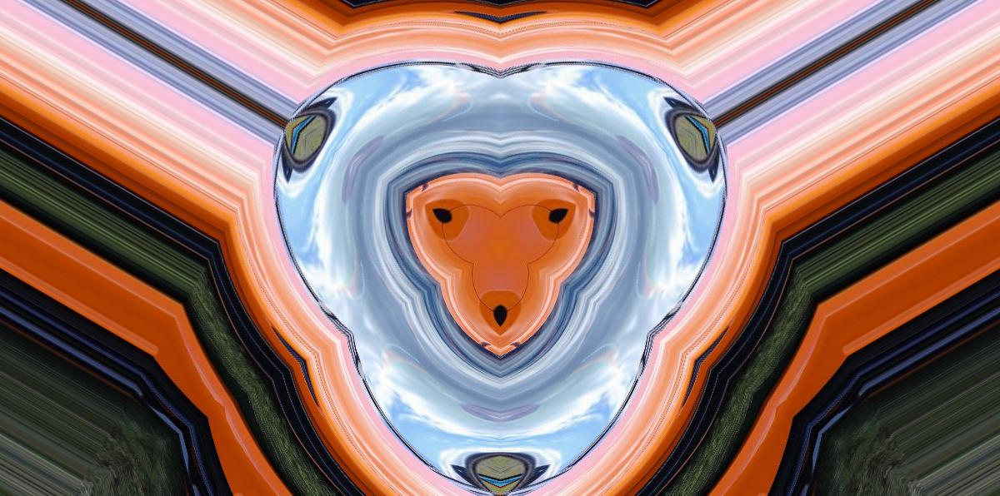

### res-crush + zoom-blur

Big pixels, then a zoom blur that streaks them outward.

```bash
op-img res-crush photo.jpg --size 32 + zoom-blur
```

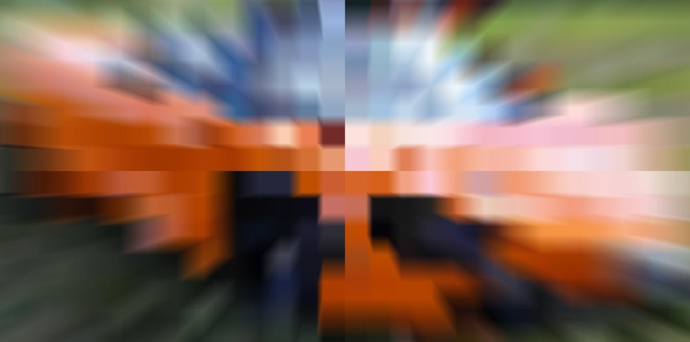

### bit-crush + flow-streak

A 1-bit crush, brushed back into painterly strokes.

```bash
op-img bit-crush photo.jpg --bits 1 + flow-streak
```

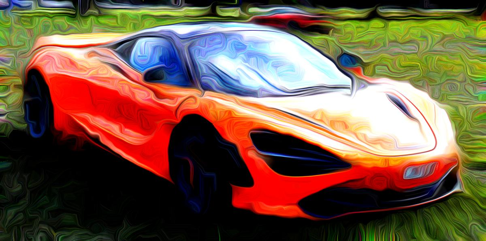

### channel-offset + swirl

Split color channels, twisted into a swirl.

```bash
op-img channel-offset photo.jpg --r 140,50 --g -20,40 --b -120,-40 + swirl
```

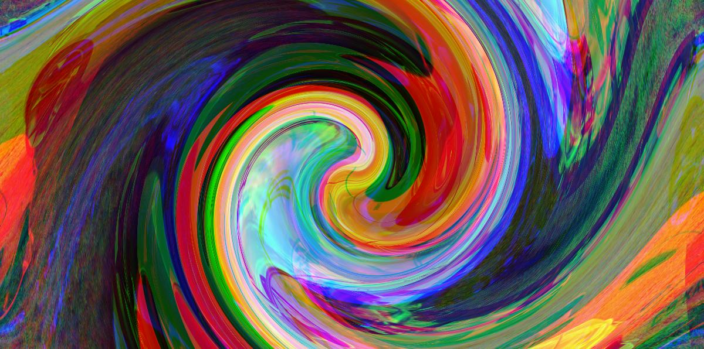

### pixel-sort + drip + invert-lightness

Columns sorted, bright pixels dripping upward, then the lightness flipped.

```bash
op-img pixel-sort photo.jpg --direction column + drip --length 500 --threshold 120 --direction up + invert-lightness
```

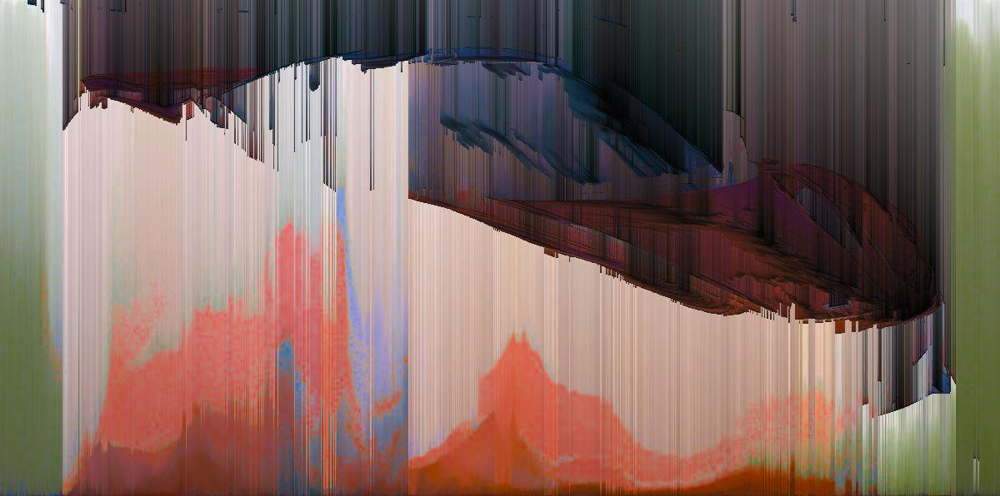

## Adding a patch

A patch is a directory in `patches/`, named after the patch. It holds either a Python script with its `requirements.txt`, or a shell script. `op-img` finds patches by name, so there's nothing to register. A missing input prints `Error: file not found`. Its own tests go in `tests/test_<name>.py`. The name goes in `ALL_PATCHES` in `tests/test_op_cli.py`, and its default output name in `DEFAULT_NAMES` in `tests/test_conventions.py`, which checks the shared conventions for every patch.

## License

MIT. See [LICENSE](LICENSE).
